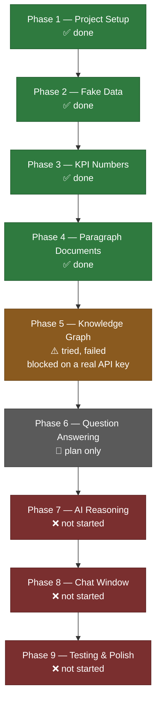
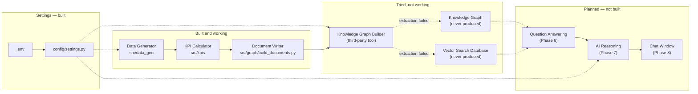
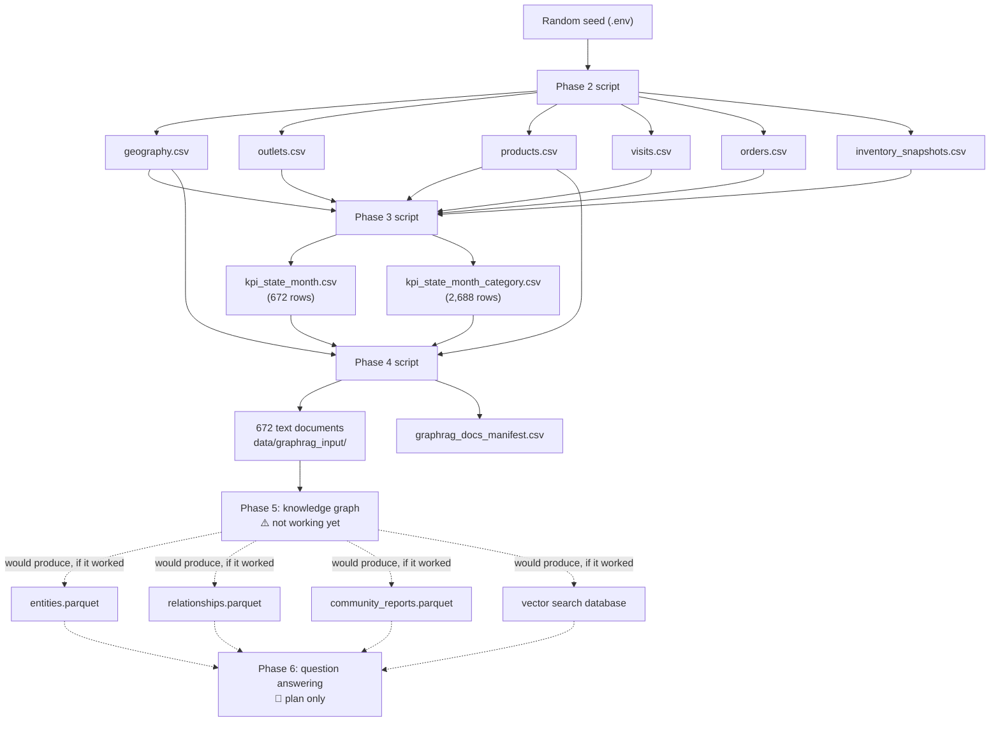
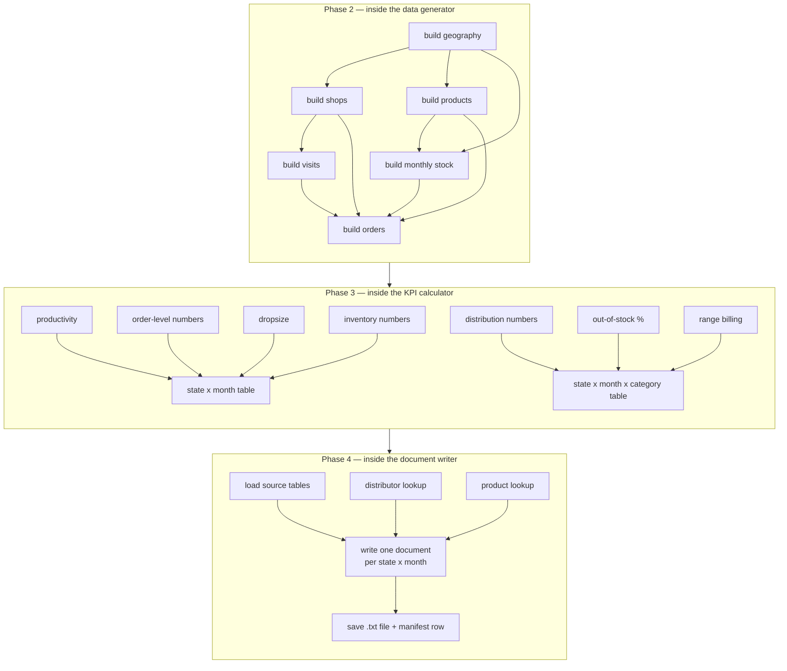
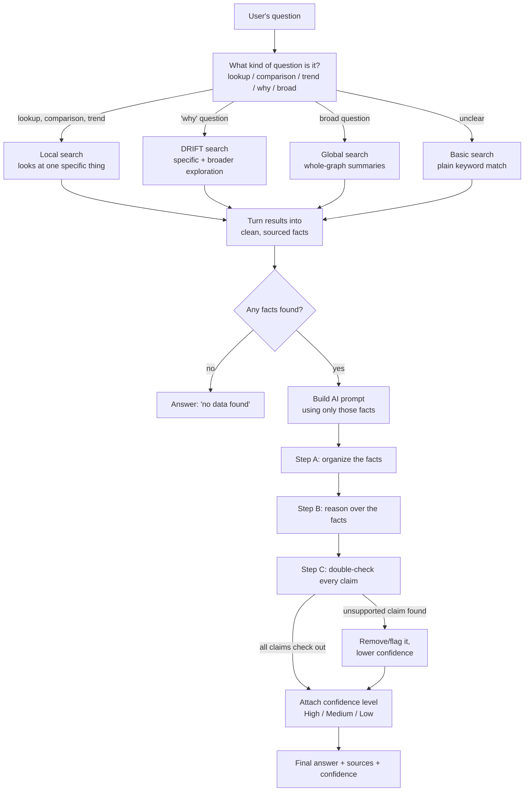
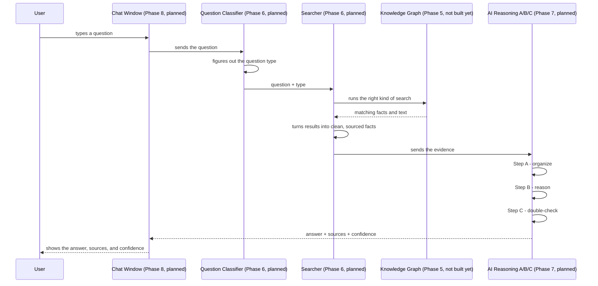

# GPIL Sales & Distribution Chatbot — Plain-Language Design Doc

**Project folder:** `/Users/namanbhatt/Downloads/GPIL/code`
**Branch this was written on:** `phase5-ollama-test` (a test branch off `main`, used for one experiment)
**Written on:** 2026-07-21

## What is this project, in one paragraph?

GPIL wants a chatbot that can answer questions about how their sales and distribution business is doing — things like "how did Punjab do in March?" or "why did stock-outs go up in Assam?". To do that, we're building a pipeline: make realistic fake sales data → turn it into business numbers (KPIs) → turn those numbers into readable paragraphs → feed those paragraphs into a tool called GraphRAG so it can build a "knowledge graph" (a web of facts and how they connect) → let an AI answer questions using that graph → put a chat window on top. That's 9 phases total. As of this document, Phases 1–4 are done and working. Phase 5 was attempted but failed. Phases 6–9 haven't been built yet — Phase 6 has a written plan, the rest don't.

## How to read this document

- **Phases 1–4:** This is real, working code. It runs, it's tested, and the files it produces are described exactly as they come out.
- **Phase 5:** This was tried as a quick, throwaway test — not proper project code — and it did not work. This section is an honest record of what was tried and exactly where it broke.
- **Phase 6:** This is a plan only. Nothing has been built yet.
- **Phases 7, 8, 9:** Not started. Not even a plan yet, beyond a name and a one-line placeholder file.

Nothing described here is aspirational — if something isn't built, it's clearly labeled as "not built" or "planned."

---

## Table of Contents

1. [Phase 1 — Getting the Project Ready](#phase-1)
2. [Phase 2 — Making Fake (but Realistic) Sales Data](#phase-2)
3. [Phase 3 — Turning Raw Data into Business Numbers (KPIs)](#phase-3)
4. [Phase 4 — Turning Numbers into Readable Paragraphs](#phase-4)
5. [Phase 5 — Trying to Build the Knowledge Graph (this failed)](#phase-5)
6. [The Whole Pipeline, Start to Finish](#e2e)
7. [All the Pieces at a Glance](#architecture)
8. [Phase 6 Plan — Answering Questions (not built yet)](#phase-6)
9. [Diagrams](#diagrams)
10. [Where Everything Lives on Disk](#folder-structure)
11. [What Could Be Improved Later](#future)

---

<a name="phase-1"></a>
## Phase 1 — Getting the Project Ready

**Status:** ✅ Done. (commit `3e23b02`)

### What this phase does
Before writing any real logic, we needed the basics in place: a folder structure, one central place to store settings like API keys, a locked-down list of software versions so the project doesn't randomly break, and a way to run automated tests. Think of it as setting up the kitchen before cooking.

### What goes in
Nothing — this phase builds the project from scratch. The only thing behind it is the written project brief (`GPIL_GraphRAG_Requirements.pdf`).

### What comes out
- `config/settings.py` — the one place that reads settings like API keys
- `pyproject.toml` and `requirements.txt` — locked list of what software versions this project needs
- `.env.example` — a template showing what secret values are needed (without the real secrets)
- `README.md` and `GIT_GUIDE.md` — a project overview and a plain-language git how-to
- Empty starter folders for each future phase (`data_gen`, `kpis`, `graph`, `inference`, `ui`)
- `tests/test_config.py` — the first automated tests

### How it works
1. The settings file figures out where the project folder is on disk, no matter where you run it from.
2. It looks for a file called `.env` (a private file that holds secrets like API keys) and loads whatever is in it.
3. It bundles all the settings the project needs — API key, API address, which AI model to use, which embedding model to use, a fixed "random seed" number (more on that in Phase 2), and the project's folder path — into one tidy object.
4. If the API key is missing, this phase does **not** stop and complain. It just leaves it blank. Checking whether the key actually works is left to whichever later phase actually needs to call the AI.

### What we assumed
- One shared `.env` file is enough for the whole project — we don't need separate settings per phase.
- The same API key and models will be reused later for both building the knowledge graph (Phase 5) and answering questions (Phase 7).

### What's not perfect yet
- We never check if a filled-in API key actually *works* — we only check that something was typed in.
- We don't validate that settings like the API address are actually sensible values.

### How we checked it works
`tests/test_config.py` has 4 tests: settings load correctly from the environment, a missing key comes back blank (never a fake fallback), the default random seed is stable, and the seed can be overridden. When we re-ran the full test suite (27 tests across Phases 1–4) while writing this document, it took **13 minutes 19 seconds** — much slower than the "~30 seconds" recorded earlier, because the dataset has grown a lot since then (see Phase 2's notes).

### Example
A `.env` file like this:
```
OPENAI_API_KEY=sk-...
OPENAI_API_BASE=https://api.openai.com/v1
LLM_MODEL=gpt-4o
EMBEDDING_MODEL=text-embedding-3-small
RANDOM_SEED=42
```
gets turned into a settings object the rest of the code can use directly, instead of every file reading environment variables on its own.

---

<a name="phase-2"></a>
## Phase 2 — Making Fake (but Realistic) Sales Data

**Status:** ✅ Done. (commits `d11194c`, then revised in `904038e`)
**Code:** `src/data_gen/generate_synthetic_data.py`

### What this phase does
We don't have access to GPIL's real sales data, so this phase invents a realistic stand-in: a distribution network (states → zones → distributors → sales reps), a product list, and about 2 years of store visits, orders, and stock levels. The data isn't random noise — it's built to behave the way a real business would, including some believable ups and downs, so later questions like "why did this state underperform" have real patterns to point to.

### What goes in
Nothing from a file — just fixed settings written into the code itself (list of states, ratios for the distribution network, product categories, seasonal boosts) plus the fixed random seed from Phase 1. A "random seed" is just a starting number that makes randomness repeatable — using the same seed always produces the exact same fake data.

### What comes out
All saved as CSV files (spreadsheet-style tables) in the `data/` folder:

| File | How many rows | What each row is |
|---|---|---|
| `geography.csv` | 1,654 | One state, zone, distributor, or sales rep |
| `outlets.csv` | 121,614 | One retail shop |
| `products.csv` | 63 | One product |
| `visits.csv` | 3,938,483 | One sales rep visiting one shop |
| `orders.csv` | 8,310,317 | One product ordered in one order |
| `inventory_snapshots.csv` | 214,704 | One distributor's stock of one product in one month |

### How it works
Everything is built in order, since later steps depend on earlier ones:
1. **Build the geography** — for each of the 28 real Indian states, create 2 zones; for each zone, 2–3 wholesale distributors; for each distributor, 5–15 sales reps. Everything lands in one table so later code doesn't need to trace parent-child links to know which state something belongs to.
2. **Build the shops** — each sales rep gets 70–100 shops assigned to them. Each shop gets a type (Paan/Tobacco shop, Kirana/grocery, Modern Trade, or Dealer) and a tier (Gold, Silver, or Bronze — used later to weight how much a shop "counts"). 5% of shops are marked inactive.
3. **Build the products** — 4 categories (GPI, IPM, Ferrero, Candy), each with a few product lines and a realistic price range.
4. **Build the monthly stock levels** — for every distributor and product, simulate 24 months of stock: how much came in, how much sold, what's left. About 8% of the time, a "supply disruption" cuts deliveries sharply, which causes stock-outs later. This step runs before orders, because it limits how much can actually be delivered.
5. **Build the shop visits** — each shop gets 0–2 visits a month. Two deliberate patterns are baked in here: (a) some months (festival season — Oct/Nov/Dec/Jan) get a sales boost, and (b) each state gets its own fixed "performance factor" — a consistent nudge up or down that stays the same across all 24 months. This second one is the intentional state-to-state difference the project needs so questions like "why is this state weaker" have a real, consistent answer.
6. **Build the orders** — for every visit where an order was placed, pick 1–6 products (only from categories that shop type is allowed to sell), with Ferrero/Candy getting an extra boost in Oct/Nov. If that month had a supply disruption, the order gets only partially delivered.
7. Save all six tables as CSV files.

### What we assumed
- The real GPIL network has around 600,000 shops; we scaled the zone/distributor counts down to keep the data smaller, but kept realistic ratios for sales-reps-per-distributor and shops-per-rep — landing at about 121,600 shops. This is safe because later phases (Phase 5 onward) only read 672 summary documents, not the raw shop-level data.
- Only 3 product line names are real (Marlboro, TicTac, Kinder_Joy — given to us directly); the rest are generic placeholders since we don't have the real internal names.
- All 4 shop types are assumed able to sell all 4 product categories, which may not match reality.

### What's not perfect yet
- It's entirely made-up data — no real GPIL numbers were used.
- The "why is this state different" factor is just random noise with no real story behind it (like "this state had a strike") — it creates a statistical pattern, not a narrative one.
- The 24-month window is fixed to end in July 2026; running this again later won't automatically move the window forward.
- A couple of generated fields (onboarding date, product launch date) aren't used by any calculation yet.
- No returns, damaged goods, or price changes are modeled.
- One random seed controls everything — you can't vary just the network size or just the randomness independently.
- Generating the data is slow (well over 10 minutes now, versus ~30 seconds when the dataset was smaller), because part of the code processes data one row at a time instead of all at once. Since three separate test files each regenerate this data from scratch, running the whole test suite now takes a while.

### How we checked it works
7 automated tests: running the generator twice with the same seed gives identical results; all six tables come out non-empty; the hierarchy structure is correct; all the ID links between tables actually resolve; order numbers make sense (nothing negative, nothing delivered more than ordered); stock levels never go negative; and the deliberate imperfections (stock-outs, partial deliveries) are actually present in the output, not just theoretically possible.

### Example
First few rows of what actually comes out:
```
geography.csv:
unit_id,unit_type,unit_name,parent_unit_id,state_name
ST01,State,Andhra Pradesh,,Andhra Pradesh
ZN0001,Zone,Andhra Pradesh Zone 1,ST01,Andhra Pradesh
WD0001,WD,"Rodriguez, Figueroa and Sanchez Distributors",ZN0001,Andhra Pradesh
SE00001,SE,Brian Yang,WD0001,Andhra Pradesh
```
Console summary when it finishes:
```
geography.csv: 1,654 rows
outlets.csv: 121,614 rows
products.csv: 63 rows
inventory_snapshots.csv: 214,704 rows
visits.csv: 3,938,483 rows
orders.csv: 8,310,317 rows
```

---

<a name="phase-3"></a>
## Phase 3 — Turning Raw Data into Business Numbers (KPIs)

**Status:** ✅ Done. (commit `f4671ed`)
**Code:** `src/kpis/compute_kpis.py`

### What this phase does
Nobody is going to ask the chatbot "how did order line #17 go" — they'll ask "how did Punjab do in March?". So this phase takes all the individual visits, orders, and stock records from Phase 2 and rolls them up into monthly business metrics per state (and per state + product category), the same kind of numbers GPIL actually tracks.

### What goes in
All six CSV files from Phase 2.

### What comes out
Two summary tables:

| File | Rows | One row = | What's in it |
|---|---|---|---|
| `kpi_state_month.csv` | 672 (28 states × 24 months) | one state, one month | Productivity, SKUs per order, Service Level, Dropsize, Inventory Turns, Inventory Days |
| `kpi_state_month_category.csv` | 2,688 (28 × 24 × 4) | one state, one month, one category | Numeric Distribution, ACV, Out-of-Stock %, Range Billing |

These are split into two tables because some metrics (like "what % of eligible shops carry this category") only make sense per category, while others (like overall productivity) describe the state as a whole.

### How it works
1. Load all six raw tables, making sure every date column is read as an actual date.
2. Round every date down to its month, so a visit on the 2nd and one on the 17th land in the same monthly bucket.
3. Build a lookup so we know which state each distributor belongs to (stock data is tracked per distributor, not per state).
4. **State-level numbers**, grouped by state and month:
   - **Productivity** = visits that resulted in an order ÷ total visits.
   - **SKUs per transaction** and **Service Level** (how much of what was ordered actually got delivered).
   - **Dropsize** = total units ordered ÷ number of productive visits. (Flagged as "needs GPIL to confirm this definition.")
   - **Inventory Turns** and **Inventory Days** — how fast stock moves, rolled up from distributor level to state level.
5. **State + category numbers**, grouped by state, month, and category:
   - Figure out which shops are even allowed to sell each category (the "eligible" pool).
   - **Numeric Distribution** = % of eligible shops that actually billed something. **ACV** is the same idea, but Gold shops count 3x, Silver 2x, Bronze 1x. (Also flagged "needs GPIL to confirm.")
   - **Out-of-Stock %** = share of monthly stock records flagged as stocked-out.
   - **Range Billing** = of the shops that bought anything in a category, what fraction of that category's full product range did they buy, on average. (Also flagged "needs GPIL to confirm.")
6. Save both tables as CSVs.

### What we assumed
Marked directly in the code as things GPIL should confirm, not silent guesses:
- The definition of Dropsize (units per productive visit).
- The definition of Range Billing.
- The tier weights used for ACV (Gold=3, Silver=2, Bronze=1) — a placeholder, not a real business rule.
- Inventory Days assumes every month is 30 days, even though real months vary.

### What's not perfect yet
- Numbers are only available at state × month level — there's no zone, distributor, sales-rep, or weekly breakdown.
- The three "needs confirmation" metrics shouldn't be treated as final until GPIL signs off.
- No month-over-month change (like "% up from last month") is pre-calculated — that would have to be done separately.

### How we checked it works
7 automated tests: no states or months are missing or duplicated in either table; no blank values anywhere; percentage-style numbers stay between 0 and 1; numbers that should always be positive (like Dropsize) never come out as zero or negative; there's a real, meaningful spread between states' productivity numbers (proving the "state performance factor" from Phase 2 survives all the way through); and running the calculation twice gives identical results.

### Example
Andhra Pradesh, August 2024:
```
state_name,month,productivity,skus_per_transaction,service_level,dropsize,inventory_turns,inventory_days
Andhra Pradesh,2024-08,0.4618979151689432,3.550972762645914,0.9290886457675854,44.38599221789883,1.555963970221501,19.280652106442616
```
Same state and month, one row per category:
```
state_name,month,category_name,numeric_distribution,acv,oos_pct,range_billing
Andhra Pradesh,2024-08,GPI,0.5055220883534136,0.49862721171446006,0.07857142857142857,0.07166974038870762
Andhra Pradesh,2024-08,IPM,0.33684738955823296,0.33267236119585114,0.07142857142857142,0.10554609325101127
Andhra Pradesh,2024-08,Ferrero,0.22916666666666666,0.22666259914582063,0.09375,0.15868017524644032
Andhra Pradesh,2024-08,Candy,0.1844879518072289,0.18242830994508846,0.08333333333333333,0.19931972789115646
```

---

<a name="phase-4"></a>
## Phase 4 — Turning Numbers into Readable Paragraphs

**Status:** ✅ Done. (commit `e6aa386`)
**Code:** `src/graph/build_documents.py`

### What this phase does
GraphRAG (the tool we plan to use to build the knowledge graph) doesn't read spreadsheets — it reads normal sentences and has an AI pull out facts and relationships from them. So this phase takes Phase 3's number tables and writes them out as short, plain-English paragraphs — one per state per month.

### What goes in
The two KPI tables from Phase 3, plus `geography.csv` and `products.csv` from Phase 2 (needed to look up distributor and product names).

### What comes out
- 672 text files under `data/graphrag_input/`, one per state and month, e.g. `Andhra_Pradesh_2024-08.txt`
- `data/graphrag_docs_manifest.csv` — a simple index listing every file and which state/month it covers, so later steps can trace an answer back to its exact source without re-reading the text.

### How it works
1. Load the four input tables.
2. Build a lookup of which distributors operate in each state, and which product lines belong to each category.
3. Go through every state/month row (always in the same order, so results are consistent every time). For each one, write a document made of these parts:
   - An opening line naming the state and month in words ("August 2024", not "2024-08") — this matters because once the text is inside the knowledge graph, nothing else tells the AI what time period it's talking about.
   - A paragraph with all the state-level numbers written into full sentences (Productivity, Service Level as a percentage, SKUs per transaction, Dropsize, Inventory Turns, Inventory Days).
   - A paragraph naming every distributor operating in that state, spelled out exactly as it appears in the source data.
   - One paragraph per product category (always in the same order: GPI, IPM, Ferrero, Candy), covering Numeric Distribution, ACV, Out-of-Stock rate, Range Billing, and the product names in that category.
4. Save each document as a `.txt` file, and add a row to the manifest.

**One important rule followed throughout:** every name (state, distributor, category, product) is copied exactly as it appears in the source data — never shortened or reworded — because GraphRAG links facts together by matching text exactly, and "Andhra Pradesh" vs. "AP" would be treated as two unrelated things.

### What we assumed
- One document per state per month is the right size — not one per state/month/category, and not one giant document per state. This wasn't tested against other options.
- Using the same sentence structure and category order in every one of the 672 documents will help (not confuse) the AI when it links facts together — this also wasn't tested against a more varied writing style.
- Only naming distributors (without distributor-level numbers) is enough for now, since Phase 3 doesn't calculate anything at that level yet.

### What's not perfect yet
- No document mentions trends (like "up from last month") — each one is a standalone snapshot. Comparing across months would have to happen later, at question-answering time.
- Nothing below state level exists in these documents (no sales-rep or shop detail — that gets summarized away in Phase 3).
- Every document reads almost identically — same as the untested assumption above.

### How we checked it works
9 automated tests: date and filename formatting work correctly; exactly 672 files and 672 manifest rows are produced; every file listed in the manifest actually exists on disk (and vice versa); sampled documents actually contain their own state name and month; every document mentions all 4 categories; distributor and product names inside the documents match the source data exactly; no stray "nan" (a sign of a missing value) leaks into any document; and running the builder twice produces identical output.

### Example
Actual file `data/graphrag_input/Andhra_Pradesh_2024-08.txt`:
```
This document reports Sales & Distribution performance for Andhra Pradesh in August 2024.

In Andhra Pradesh during August 2024, Productivity (share of sales visits that resulted in an order) was 46.2%, and the average Service Level (share of ordered quantity actually delivered) was 92.9%. Sales executives averaged 3.55 SKUs per transaction and a Dropsize of 44.39 units per productive visit. Distributor inventory turned over 1.56 times during the month, equivalent to 19.3 days of stock on hand on average.

Andhra Pradesh is served by 4 Wholesale Distributor(s): Rodriguez, Figueroa and Sanchez Distributors, Galloway-Wyatt Distributors, Richards, Hurst and Ross Distributors, Gill, Romero and Rodriguez Distributors.

For the GPI category (franchises: GPI_Franchise_1, GPI_Franchise_2, GPI_Franchise_3, GPI_Franchise_4, GPI_Franchise_5, GPI_Franchise_6) in Andhra Pradesh during August 2024: Numeric Distribution was 50.6%, ACV (weighted distribution) was 49.9%, Out-of-Stock rate was 7.9%, and average Range Billing (share of the category's SKU range billed, among outlets that billed anything) was 7.2%.
...
```
Manifest row: `Andhra_Pradesh_2024-08.txt,Andhra Pradesh,2024-08`

---

<a name="phase-5"></a>
## Phase 5 — Trying to Build the Knowledge Graph (this failed)

**Status:** ⚠️ **Not real project code — a quick manual test on the `phase5-ollama-test` branch, and it did not work.** This is exactly why the project is currently paused. Nothing here is part of the main codebase.

### What this phase was supposed to do
Feed Phase 4's 672 paragraph documents into Microsoft's GraphRAG tool, which would use an AI to read them, pull out entities (states, distributors, categories, products) and how they relate to each other, group related things into clusters, and build a searchable knowledge graph. That graph is what Phase 6 and 7 would eventually query to answer chat questions.

### What was actually tried
Not the full set of 672 documents — just 3 of them, copied by hand into a separate, throwaway test folder:
```
data/graphrag_index_ollama_test/input/
  Andhra_Pradesh_2024-08.txt
  Andhra_Pradesh_2024-09.txt
  Assam_2024-08.txt
```
This test folder and its settings were not built by any script — they were set up by hand to run GraphRAG's own command-line tool against a **free, local AI model (Ollama)** instead of a paid one, purely as a cheap sanity check before spending real money on API calls.

### What actually came out
Only partial output, in `data/graphrag_index_ollama_test/output/` (not saved to git, test-only):
- Two files that show the documents were successfully loaded and split into chunks.
- Run logs and stats.
- **None** of the actual knowledge-graph files (entities, relationships, clusters, or the searchable vector database) — the process failed before it could produce these.

### What happened, step by step, and where it broke
This ran GraphRAG's own tool, not our code, using a settings file that pointed to:
- A **local** AI model called `llama3` (running on the same computer, via Ollama) instead of a real cloud AI model.
- A **local** embedding model called `nomic-embed-text`.
- GraphRAG's default categories to look for (`organization, person, geo, event`) — generic categories, not ones tailored to this project (like `State`, `Distributor`, `Category`, `Product`).
- GraphRAG's default instructions for how to extract facts — also generic, not customized for our style of documents.

What happened when we ran it (2026-07-19, 20:01–20:18):
1. Loading the 3 documents — worked.
2. Splitting them into chunks — worked.
3. Preparing the final document list — worked.
4. **Extracting entities and relationships — this is where it failed.** It ran for about 17 minutes, processed all 3 documents, then reported:
   - A warning that 9 relationships referred to things that didn't exist.
   - An error: "no relationships detected during extraction."
   - The whole process then stopped. Nothing after this step (summarizing, clustering, building the vector database) ever ran.

The AI model was called 7 times and took about 411 seconds per call on average (almost 48 minutes of computer time total) — and still never produced usable results. The embedding step worked fine on its own; the failure was specifically in extraction.

### What we assumed, and where we were wrong
- We assumed a free local AI model could stand in for a real one just to test that the pipeline mechanically works. **This didn't hold up** — extraction failed outright.
- We assumed GraphRAG's generic default categories and instructions (built for things like news articles) would work reasonably well on our business-report-style text without any customization. **This was untested, and is likely a big part of why it failed** — our real "entities" (State, Distributor, Category, Product) don't map cleanly onto GraphRAG's generic defaults.

### What's not working yet
- **There is no working knowledge graph.** Nothing downstream (question answering, the chat UI) has anything to actually query yet.
- We only tested with 3 documents out of 672 — even if this had worked, we still wouldn't know the cost or time for all 672.
- The categories and instructions were never customized for our data — very likely the main cause of the failure.
- Testing with a free local model was only ever meant to save money before testing the real thing — it doesn't tell us whether the real (paid) model will work.
- This whole experiment lives on a separate branch and was never merged — the main branch is still only as far as Phase 4.

### How we checked it works
We didn't — there are no automated tests for this. The only "check" was watching it run once by hand, and it failed.

### Example of what went wrong
```
2026-07-19 20:18:14.0297 - WARNING - Dropped 9 relationship(s) referencing non-existent entities.
2026-07-19 20:18:14.0297 - ERROR - Graph Extraction failed. No relationships detected during extraction.
```

### What needs to happen before we try this again for real
1. A working, paid API key for a real AI model (this is the main thing blocking progress right now).
2. Custom categories in the settings that match our business (State, Distributor, Category, Product) instead of the generic defaults.
3. Instructions for the AI that are written for — or at least tested against — our specific document style.
4. A proper script that's part of the project (not a manual command-line run), so this step can be repeated and tested like every earlier phase.
5. Testing on a small real slice of data before running the full 672 documents, since this step can get expensive.

---

<a name="e2e"></a>
## The Whole Pipeline, Start to Finish

Everything up through Phase 4 runs entirely on your own computer, with no AI calls at all. The AI only gets involved starting at Phase 5.

```
.env (settings)
        │
        ▼
Phase 2 — make fake sales data
        │  writes 6 tables to data/:
        │    geography, outlets, products,
        │    visits, orders, inventory_snapshots
        ▼
Phase 3 — turn that into business numbers
        │  reads the 6 Phase 2 tables
        │  writes 2 tables to data/:
        │    kpi_state_month, kpi_state_month_category
        ▼
Phase 4 — turn those numbers into paragraphs
        │  reads the KPI tables + geography + products
        │  writes to data/graphrag_input/:
        │    672 text documents, one per state and month
        │  writes a manifest (index) file
        ▼
Phase 5 — build the knowledge graph (NOT WORKING YET)
        │  meant to read all 672 documents
        │  meant to produce: entities, relationships,
        │    clusters, and a searchable database
        │  ⚠ blocked: needs a real paid AI key +
        │    categories/instructions tuned for our data
        ▼
Phase 6 — answer questions using the graph (PLANNED ONLY — see below)
        ▼
Phase 7 — the AI reasoning layer (NOT STARTED)
        ▼
Phase 8 — the chat window (NOT STARTED — just an empty placeholder file)
        ▼
Phase 9 — testing & polish (NOT STARTED)
```

Where every file actually lives:

| File | Made by | Location |
|---|---|---|
| `geography.csv` | Phase 2 | `data/geography.csv` |
| `outlets.csv` | Phase 2 | `data/outlets.csv` |
| `products.csv` | Phase 2 | `data/products.csv` |
| `visits.csv` | Phase 2 | `data/visits.csv` |
| `orders.csv` | Phase 2 | `data/orders.csv` |
| `inventory_snapshots.csv` | Phase 2 | `data/inventory_snapshots.csv` |
| `kpi_state_month.csv` | Phase 3 | `data/kpi_state_month.csv` |
| `kpi_state_month_category.csv` | Phase 3 | `data/kpi_state_month_category.csv` |
| 672 text documents | Phase 4 | `data/graphrag_input/<State>_<YYYY-MM>.txt` |
| `graphrag_docs_manifest.csv` | Phase 4 | `data/graphrag_docs_manifest.csv` |
| Knowledge graph (entities/relationships/clusters/database) | Phase 5 | **not made yet** — would live in a `data/graphrag_index/` type folder, similar in shape to the failed test folder |

None of the `data/` folder is saved to git — every file in it can be recreated by re-running the right script with the same fixed random seed. Only the *code* that produces these files is saved to git.

---

<a name="architecture"></a>
## All the Pieces at a Glance

| Piece | Status | What it does | Where it lives |
|---|---|---|---|
| **Settings** | ✅ built | One place to read secrets and settings from `.env` | `config/settings.py` |
| **Data Generator** | ✅ built | Creates the 6 raw tables simulating GPIL's business | `src/data_gen/generate_synthetic_data.py` |
| **KPI Calculator** | ✅ built | Rolls raw data up into monthly business numbers | `src/kpis/compute_kpis.py` |
| **Document Writer** | ✅ built | Turns KPI numbers into readable paragraphs | `src/graph/build_documents.py` |
| **Knowledge Graph Builder** | ⚠️ tried, failed | Would use GraphRAG to pull facts and relationships out of the documents | Not our code — a third-party tool; only a failed manual test exists |
| **Knowledge Graph** | ❌ doesn't exist | The actual web of facts and relationships | Would be created once the builder above works |
| **Vector Search Database** | ❌ doesn't exist | Lets the AI find relevant text quickly by meaning, not just keywords | Would be created once the builder above works |
| **Question Answering** | 📝 planned (Phase 6) | Figures out what kind of question was asked and searches the graph for the answer | Not built — plan only, see below |
| **AI Reasoning Layer** | 📝 planned (Phase 7) | Turns search results into a careful, fact-checked answer | Not built — only an empty placeholder file exists |
| **Chat Window** | 📝 planned (Phase 8) | The actual screen a user types questions into | Not built — only an empty placeholder file exists |

### How the pieces talk to each other today
Right now, every finished piece communicates purely by writing files and reading files — nothing is wired together in memory. Each script reads whatever files the previous phase produced and writes its own output files. This is on purpose: it means every phase can be run, tested, and inspected on its own, without needing to first run every phase before it. The only thing shared directly between phases in code is the settings loader (`get_settings()`), which every phase's script calls to find the project folder and any relevant settings.

The planned future pieces (Phase 6, 7, 8) would likely work the same way at the handoff points, but exactly how they'll talk to each other in code hasn't been decided yet — see the plan below for the intended shape.

---

<a name="phase-6"></a>
## Phase 6 Plan — Answering Questions (not built yet)

Nothing in this section is built. This is a plan for how question-answering (Phase 6) and getting a final answer from the AI (Phase 7) would work, **assuming Phase 5's knowledge graph eventually gets built successfully**.

### The flow, step by step
1. A user types a question into the (future) chat window.
2. The system figures out **what kind of question it is**.
3. Based on that, it picks **the right way to search** the knowledge graph.
4. It runs the search and turns the results into clean, structured facts with sources attached.
5. It builds a prompt for the AI containing only those facts.
6. The AI answers in three careful steps (explained below).
7. The answer, its sources, and a confidence level get sent back to the chat window.

### What kinds of questions we'd expect
- **Simple lookup** — "What was the Out-of-Stock rate for GPI in Kerala in March 2025?" → one specific state, month, and category.
- **Comparison** — "Compare Punjab and Haryana's Productivity in Q1 2025." → two or more things, same metric.
- **Trend** — "How has Service Level in Maharashtra changed over the last 6 months?" → one thing, many months.
- **"Why" questions** — "Why did ACV drop in Assam in October?" → needs more than one number; needs related context (other metrics, disruptions, seasonality) to explain a cause.
- **Broad questions** — "Which states have the worst distribution overall?" → spans many or all states at once.

### How each question type would be searched
GraphRAG offers a few different search styles, and each question type would map to one:
- **Local search** (looks at one specific thing and what's directly connected to it) — for simple lookups, comparisons, and trends, since these name specific states/categories.
- **Global search** (reasons across the whole graph using cluster summaries) — for broad questions spanning many states.
- **DRIFT search** (a mix of the two — starts specific, then branches out) — for "why" questions, since the real cause might be in a related but not directly-named piece of data.
- **Basic search** (plain keyword/similarity matching, no graph structure) — a fallback for anything that doesn't fit neatly into the above, or as a quick cheap first check.

### Turning search results into facts
Whatever the graph search returns (snippets of text, descriptions, summaries) would get converted into a clean, structured format — something like: metric name, value, state, month, category, which document it came from, and how confident the search was. The document manifest from Phase 4 would be used to trace any result back to its exact source.

### Building the AI prompt
The AI would only ever be shown the specific facts collected above — never the raw spreadsheets, never the full set of 672 documents. It would also be told explicitly: only use the facts given, say which fact backs up each claim, and if the facts don't clearly answer the question, say so instead of guessing.

### Getting the final answer — three careful steps
- **Step A — organize:** Turn the retrieved evidence into clean, structured facts. Low creativity, just extraction.
- **Step B — reason:** Let the AI think through the answer using *only* those facts, writing a draft answer that references specific evidence.
- **Step C — double-check:** A separate pass that checks every claim in the draft answer actually traces back to a specific fact from Step A. Anything that doesn't get removed, or the answer's confidence gets downgraded.

### What a finished answer would look like
- A plain-English answer.
- A list of sources (which document, i.e. which state and month, and which specific numbers were used).
- A confidence level: **High** (several pieces of evidence clearly answer the question), **Medium** (evidence is partial or needs a small logical leap), or **Low** (evidence is thin or conflicting — the answer should lean toward "we can't tell from the data" rather than guess).
- For comparison questions, a clean side-by-side view of the numbers being compared.

### Handling things going wrong
- **No matching data found** (e.g. a misspelled state) → say clearly "no data found," don't let the AI guess.
- **Weak match** → mark it Low confidence instead of pretending it's a strong answer.
- **Conflicting data** → point out the conflict instead of silently picking one side.
- **AI or network failure** → show the user a clear error with a retry option, never quietly fall back to an answer that isn't grounded in real data.
- **Failed double-check** → remove or flag the part of the answer that couldn't be backed up.

### Why this matters
Every answer would come with its evidence and confidence level attached, so a user can see exactly why the system is saying what it's saying — directly supporting the original requirement that the system should say "I don't know" rather than make something up.

---

<a name="diagrams"></a>
## Diagrams

### 1. The whole 9-phase project, colored by status



### 2. The pieces and how they'd connect



### 3. The files, phase by phase



### 4. Inside each script



### 5. Phase 6 question-answering flow (plan only)



### 6. A user's question, start to finish (plan only)



---

<a name="folder-structure"></a>
## Where Everything Lives on Disk

```
code/                                  # the project folder
├── .env                               # real secrets (private, never shared)
├── .env.example                       # template showing what secrets are needed
├── .gitignore
├── GIT_GUIDE.md                       # plain-language git how-to for the user
├── README.md                          # project overview and setup steps
├── pyproject.toml                     # test configuration
├── requirements.txt                   # exact software versions needed
│
├── config/
│   ├── __init__.py
│   └── settings.py                    # the ONLY place secrets/settings are read
│
├── src/                                # the main code
│   ├── __init__.py
│   ├── data_gen/                       # Phase 2
│   │   ├── __init__.py
│   │   └── generate_synthetic_data.py  # builds the 6 raw data tables
│   ├── kpis/                           # Phase 3
│   │   ├── __init__.py
│   │   └── compute_kpis.py             # builds the 2 KPI tables
│   ├── graph/                          # Phases 4-6
│   │   ├── __init__.py
│   │   └── build_documents.py          # Phase 4: numbers -> paragraphs
│   │                                    # (Phase 5/6 code doesn't exist yet)
│   ├── inference/                      # Phase 7 — empty placeholder
│   │   └── __init__.py
│   └── ui/                             # Phase 8 — empty placeholder
│       └── __init__.py
│
├── tests/
│   ├── test_config.py                  # Phase 1 — 4 tests
│   ├── test_data_gen.py                # Phase 2 — 7 tests
│   ├── test_kpis.py                    # Phase 3 — 7 tests
│   └── test_build_documents.py         # Phase 4 — 9 tests
│
├── data/                               # all generated files — never saved to git
│   ├── geography.csv                   # Phase 2 output
│   ├── outlets.csv                     # Phase 2 output
│   ├── products.csv                    # Phase 2 output
│   ├── visits.csv                      # Phase 2 output
│   ├── orders.csv                      # Phase 2 output
│   ├── inventory_snapshots.csv         # Phase 2 output
│   ├── kpi_state_month.csv             # Phase 3 output
│   ├── kpi_state_month_category.csv    # Phase 3 output
│   ├── graphrag_input/                 # Phase 4 output — 672 text documents
│   ├── graphrag_docs_manifest.csv      # Phase 4 output — index of the documents
│   └── graphrag_index_ollama_test/     # the FAILED Phase 5 test — never saved to git
│       ├── input/                      # the 3 test documents
│       ├── output/                     # partial results only
│       ├── cache/, logs/, prompts/, settings.yaml, .env
│
├── docs/
│   └── TECHNICAL_DESIGN.md             # this document
│
└── venv/                               # local Python environment, never saved to git
```

---

<a name="future"></a>
## What Could Be Improved Later

Beyond finishing Phases 5–9, here are some things worth doing once Phase 6 exists and works:

- **Tune the knowledge-graph builder for our data**: give it custom categories (State, Distributor, Category, Product, KPI Metric) and tested instructions, instead of GraphRAG's generic defaults — directly based on what we learned from the failed test.
- **Avoid rebuilding the whole graph every time**: right now, any change to the earlier phases would mean re-processing all 672 documents from scratch. A way to update just what changed would save a lot of time and cost.
- **Add distributor- and sales-rep-level numbers**: right now KPIs stop at the state level; going deeper would let the chatbot answer more specific questions like "which distributor in Punjab is underperforming."
- **Add trend language to the documents**: right now each document is a snapshot with no month-over-month comparison built in. Writing that in directly could make "why" questions easier to answer.
- **Validate against real GPIL data**: replace the placeholder assumptions (Dropsize, Range Billing, ACV weights — all flagged "needs confirmation") once real definitions are available.
- **Build a proper testing setup for question answering (Phase 9)**: a set of sample questions with known correct answers, to measure how accurate and well-sourced the chatbot's answers are.
- **Track cost and speed of AI calls**: especially once the more expensive search types (DRIFT/global) come into use for harder questions.
- **Support follow-up questions**: right now the plan only handles one question at a time; a follow-up like "what about last month?" would need the system to remember context.
- **Add automated tests once Phase 5 has real code**: Phases 1–4 all have test suites; Phase 5 doesn't yet because it isn't real project code yet.
- **Speed up the test suite**: right now, three different test files each regenerate the full fake dataset separately, and one part of the data generator processes things one row at a time instead of all at once — both are slow and could be optimized.
